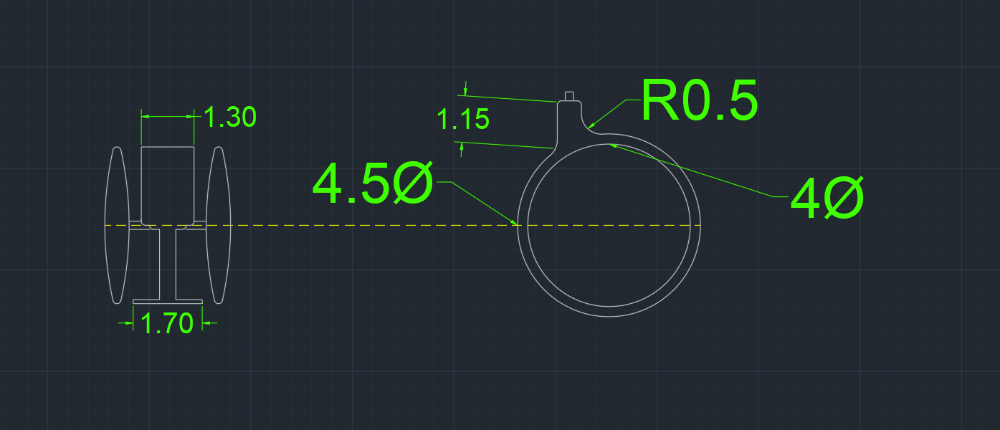
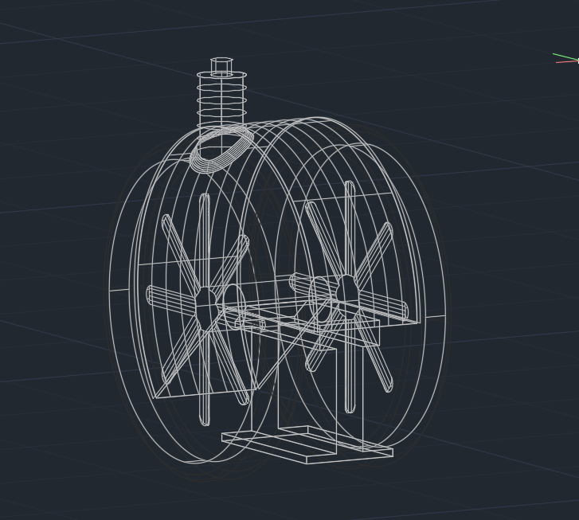
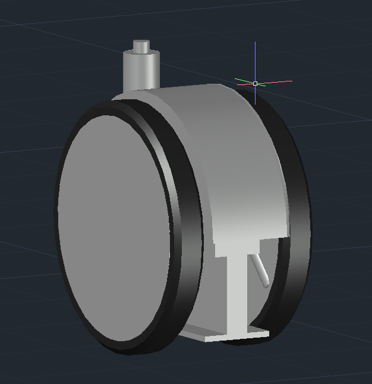
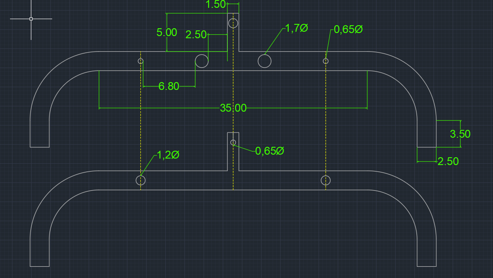
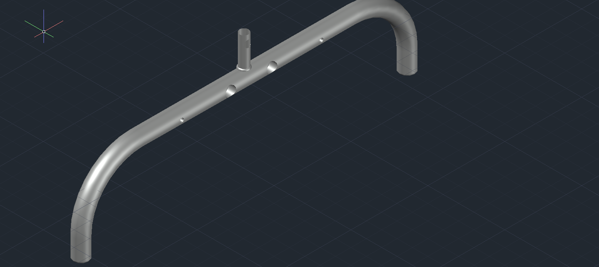
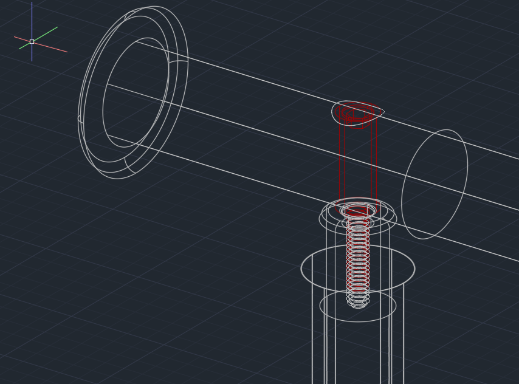
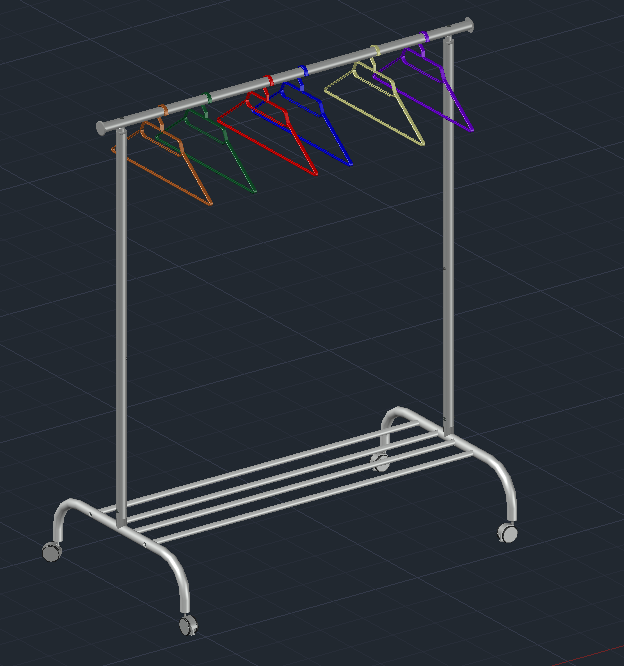

# 3D Model of IKEA Rigga Clothes Rack

## Overview
This repository contains a detailed 3D model of the IKEA RIGGA clothes rack created in Autodesk AutoCAD 2023. The model features accurate dimensions and proportions based on real-world measurements of the original IKEA product, making it suitable for visualization, modification, or manufacturing purposes.

## Project Description
The 3D model was created as part of a Computer Assisted Graphics course project at the University of Bucharest, Faculty of Mathematics and Computer 
Science. All components were carefully measured, sketched, and modeled to match the actual product specifications.

## Preview Images
Below are preview images of the 3D model components and final assembly:

### Wheel Measurements and Base View
<table align = "center">
  <tr>
    <td></td>
  </tr>
</table>

<table align = "center">
  <tr>
    <td></td>
    <td></td>
  </tr>
</table>

### Bottom Bar
<table align = "center">
  <tr>
    <td></td>
    <td></td>
  </tr>
</table>

<table align = "center">
  <tr>
    <td></td>
  </tr>
</table>

## Features
- Complete 3D model with all components of the IKEA RIGGA clothes rack
- Accurate dimensions at 1:1 scale (measurements in centimeters)
- Individual components modeled separately for easy modification
- Detailed assembly showing how all components fit together
- Files saved in AutoCAD 2018 .dwg format for maximum compatibility

## Components
The model includes all parts of the clothes rack:
- Bottom bars with shelving for shoes
- Height-adjustable exterior and interior side bars with 6 height settings
- Allen screws and nuts for assembly
- Wheels for mobility
- Top bar with plastic caps
- Clothing hangers

## Complete Assembly
<table align = "center">
  <tr>
    <td></td>
  </tr>
</table>

## Technical Details
- Created in: Autodesk AutoCAD 2023
- File format: .dwg (AutoCAD 2018 Drawing)
- Scale: 1:1 (dimensions in centimeters)
- Modeling techniques used: EXTRUDE, HELIX, FILLETEDGE, ARRAYOLAR, OFFSET, 3DMOVE, ROTATE3D

## Usage
This 3D model can be used for:
- Educational purposes to understand the structure of the product
- Design modifications or customizations
- Visualization in interior design projects

## Resources

- [Autocad Wiki](https://ro.wikipedia.org/wiki/AutoCAD)
- [Rigga on Ikea](https://www.ikea.com/ro/ro/p/rigga-suport-umerase-alb-50231630/)
- [Rigga Assembly Instructions](https://www.ikea.com/ro/ro/assembly_instructions/rigga-suport-umerase-alb__AA-712786-6-2.pdf)